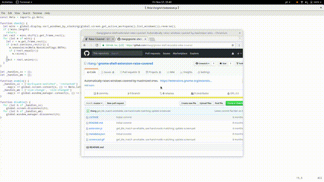

# gnome-shell-extension-raise-covered

**FORK EDIT**: I removed the code that centers and resizes the window which is being held on top. This prevents windows from jumping around while preserving the purpose of this extension. Original readme follows.

------------------------------------------------

Automatically raises windows covered by maximized ones.

# Screencast



# Installation

```sh
git clone https://github.com/rliang/gnome-shell-extension-raise-covered ~/.local/share/gnome-shell/extensions/raisecovered@rliang.github.com
gnome-shell-extension-tool -e raisecovered@rliang.github.com
```
